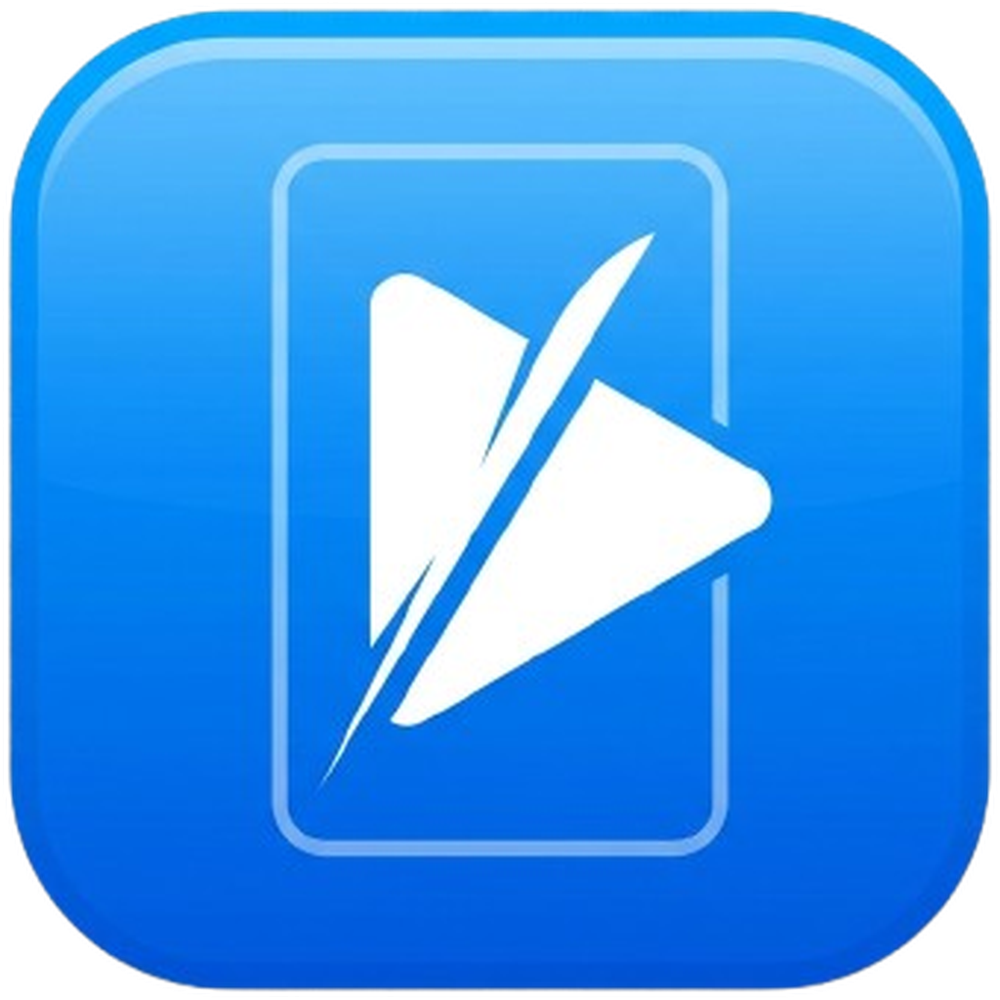

<p align="center">
  
</p>

<h1 align="center">TrimTube</h1>

<p align="center">
  YouTube videolarını (veya yerel dosyaları) indirip istediğiniz aralığı kesen, Shorts için dikey formata dönüştüren,<br>
  yapay zeka ile <b>konuşana/kişiye kilitlenen akıllı kadraj</b> ve <b>otomatik altyazı</b> uygulayabilen masaüstü uygulaması.
</p>

---

## İndirme

En son sürümü [Releases](../../releases) sayfasından indirin:

| Platform | Dosya |
|---|---|
| Windows | `TrimTube-Setup-x.y.z.exe` |
| macOS (Apple Silicon — M1/M2/M3/M4) | `TrimTube-x.y.z-arm64.dmg` |
| Linux (Debian/Ubuntu) | `trimtube_x.y.z_amd64.deb` |

> Intel Mac (x64) derlemesi şu an otomatik release sürecinde yok — GitHub'ın Intel Mac build runner'ları kısıtlı kapasiteli olduğu için güvenilir şekilde çalıştırılamıyor. Apple 2020'den beri yalnızca Apple Silicon Mac satıyor, bu yüzden mevcut Mac kullanıcılarının büyük çoğunluğu zaten desteklenen sürümü kullanabilir.

yt-dlp ve ffmpeg pakete gömülüdür, ayrıca bir şey kurmanıza gerek yoktur.

> Uygulama henüz kod imzalı değil, bu yüzden ilk açılışta işletim sistemi bir uyarı gösterebilir:
> - **Windows:** "Windows bilgisayarınızı korudu" uyarısında **Diğer bilgiler → Yine de çalıştır**'a tıklayın.
> - **macOS:** Uygulamayı Finder'da sağ tıklayıp **Aç**'ı seçin (Gatekeeper'ın "bilinmeyen geliştirici" uyarısını atlamak için).

🎯 Kişiyi takip eden akıllı kadraj artık **kurulumsuz** çalışır — kurulum paketine platforma özel dondurulmuş bir takip motoru dahildir, Python gerektirmez. 📝 Whisper ile otomatik altyazı ise hâlâ Python 3 + `faster-whisper` gerektirir (bkz. [Kaynaktan çalıştırma](#kaynaktan-çalıştırma-geliştirici)); diğer tüm özellikler kutudan çıktığı gibi çalışır.

### Otomatik güncelleme

Uygulama açılışta GitHub Releases'teki en son sürümü sessizce kontrol eder. Yeni bir sürüm varsa **sağ üstte uygulama içi bir kart** belirir — hiçbir şey kullanıcı onayı olmadan indirilmez veya kurulmaz:

1. **"Güncelle"** butonuna basınca indirme başlar, kart üzerinde ilerleme çubuğu gösterilir.
2. İndirme bitince **"Yeniden başlat ve kur"** butonu belirir; basınca kurulum sihirbazı **görünür şekilde** açılır (sessiz kurulum değildir — bir sorun olursa fark edilebilsin diye bilinçli olarak görünür bırakıldı) ve bitince uygulama otomatik yeniden başlar.

Bu akış yalnızca **Windows**'ta güvenilir çalışır. **macOS**'ta uygulama kod imzalı olmadığı için (Apple Developer sertifikası gerektirir, ücretlidir) indirme/kurulum adımı başarısız olabilir — kart bu durumda hata mesajını gösterir, yeni sürümü Releases sayfasından elle indirmeniz gerekir. **Linux (.deb)** için otomatik güncelleme desteklenmez.

## Özellikler

- **URL ile indirme** — `yt-dlp` ile herhangi bir YouTube videosunu indirir; başlık, kanal, süre ve kapak görseli otomatik gelir.
- **Uygulama içi önizleme** — indirmeden önce videoyu izleyip kesim noktalarını "Bu anı başlangıç/bitiş yap" butonlarıyla veya slider ile saniyesi saniyesine seçebilirsiniz.
- **Hassas kesim** — istediğiniz aralık yerelde `ffmpeg` ile kare hassasiyetinde kesilir.
- **Kalite seçimi** — En iyi / 1080p / 720p video ya da sadece MP3 ses.
- **Dikey 9:16 (Shorts) dönüşümü** — videoyu tek tıkla 1080×1920 dikey formata kırpar.
- **🎯 Kişiyi takip eden akıllı kadraj** — dikey formata dönüştürürken kırpma penceresi sabit kalmaz; OpenCV tabanlı yüz tespiti + takip ile kişiyi sahne boyunca izler, sahne değişse bile kişiyi yeniden bulup takibe devam eder.
- **📝 Otomatik altyazı (Whisper)** — videoda hazır altyazı yoksa, kesitin sesi `faster-whisper` ile metne çevrilip stilli olarak gömülür. Hız/kalite dengesi için model boyutu (Hızlı / Dengeli / En iyi) seçilebilir.
- **📁 Yerel dosya desteği** — YouTube bağlantısı yerine bir video dosyasını (MP4, MKV, MOV, WEBM, M4V, AVI) pencereye sürükleyip bırakabilir ya da dosya seçiciyle açabilirsiniz; kesme, format, kişi takibi, altyazı ve marka özelliklerinin tümü aynen çalışır.
- **🎯 Kadraj yolu önizlemesi** — kişi takibi açıkken, oluşacak 9:16 kırpma penceresini render'dan **önce** ayrı bir pencerede görebilirsiniz; takip edilen kişi renkli maskeyle vurgulanır, yanında canlı 9:16 çıktı ve ses.
- **🗣️ Aktif konuşana kadraj** — sahnede birden fazla kişi varsa, o an konuşanı (ses + dudak hareketi) otomatik seçip kadrajı ona kaydırır. Röportaj/diyalog kliplerinde her konuşmacıyı ayrı ayrı işaretlemeden takip eder.
- **📚 Oynatma listesi toplu indirme** — bir playlist bağlantısı yapıştırıp açtığınızda videoları seçip toplu olarak kuyruğa alabilirsiniz.
- **⏳ Arka planda kuyruk** — kuyruk işlenirken uygulama kilitlenmez; sıradaki videoyu hazırlayıp kuyruğa eklemeye devam edebilirsiniz.
- **Akıllı önbellek** — aynı videodan ikinci bir klip kesmek istediğinizde video yeniden indirilmez, saniyeler içinde sonuç alırsınız.

## Nasıl çalışır

### Reji masası ve araçlar (güncel kaynak kod)

- **Video Kes:** video karelerinden sarın; 15/30/60 saniyelik hızlı kesit seçin.
  Ses şeridini yakınlaştırıp kaydırarak sınırları ayarlayın. **Kesiti izle** seçilen
  aralığı döngüde oynatır. Klavye kısayolları ve açık/koyu tema desteklenir.
- **Kadraj:** kişi takibini açmak 9:16 çıktısını da seçer. Tek kişiyi izlemek için
  **Kişi seç** düğmesi başlangıç karesine döner; görüntüde yüzüne tıklayın.
  Başlangıç değiştiğinde kişi yeniden seçilir. **Aktif konuşan** modu ses/ağız
  hareketini kullanır; doğruluğu her sahnede garanti edilmez. Sakin, Dengeli ve
  Çevik kamera seçeneklerini **Kadrajı önizle** ile karşılaştırabilirsiniz.
  Önizlemede kutu görünürlük oranı gösterilir; bu oran kimlik doğruluğu puanı değildir.
- **Altyazı:** YouTube dili veya Whisper modelini seçip **Altyazıyı oluştur** düğmesine basın.
  Metin ve zamanları kontrol masasında düzeltin, gerekirse satır ekleyin/silin.
  **Uygula ve onayla** sonrasında dışa aktarma aynı metni kullanır; yeniden konuşma
  çözümlemesi yapılmaz. Kaynak, kesit, dil veya model değişirse tekrar kontrol gerekir.
- **Kontrol masası:** zaman sürgüsü, 1/30 saniye adımlama, oynatma hızı ve çıktı büyütme;
  yatay kadraj düzeltmesi ve analiz edilen yola dönüş. Düzeltme seçilen andan sona
  sabit kadraj uygular; sonraki noktada yeniden ayarlanabilir. Onaylanan kadraj yolu
  dışa aktarmada doğrudan kullanılır. **Uygula ve dışa aktar** mevcut seçimi kuyruğa ekler.
- **Güvenli alan:** TikTok / Shorts / Reels maskeleri üzerinde gerçek altyazı metnini
  izleyin; alt ve yan boşlukları ayarlayın veya platform yerleşimini uygulayın.
  Maskeler yaklaşık rehberdir. Font yerleşimi tarayıcı ile libass arasında küçük
  farklar gösterebilir. Vurgulu ve pop stilleri ortak kelime zamanlamasıyla önizlenir. Düzeltilmiş animasyonlu metnin
  kelime süreleri satır zamanlarından tahmin edilir.
- **Proje:** onaylı metin, kadraj yolu ve yerleşim `.trimtube` dosyasında saklanır.
  Şablon olarak açıldığında metin ve kadraj yolu başka videoya taşınmaz.

- **Marka:** logo yüksekliğini ve köşesini belirleyin; başlığı 3, 5 veya 10 saniye
  gösterin. Eksik logo ve boş başlık dışa aktarmadan önce bildirilir.
- **Sıkıştır / Akıllı Kırpma:** dosyayı küçültün veya sessizlik/dolgu seslerini
  tespit edip onayladığınız aralıkları çıkarın. Kurgu masasındaki yerel dosyayı
  doğrudan kullanabilir, üretilen sonucu tekrar kurgu masasında açabilirsiniz.
- **İçerik Asistanı** (önceki adı AI Araçları): ortak transkriptten başlık ve
  paylaşım metni, konu arama, dikkat çekici anlar ve içerik uyarıları üretir.
  Gemini anahtarı gerektirir; bir telif/Content ID kontrolü değildir.
- **Hikâye Kurgusu** (önceki adı Moodlar): tarz ve süre seçerek sahne planı
  oluşturun, gözden geçirip seslendirin. Gemini veya ElevenLabs seslendirmesi
  kullanılabilir; hizmet kullanımı sağlayıcı hesabınıza bağlıdır.
- **Destek Görüntüleri** (B-Roll): Gemini + Pexels önerilerini gözden geçirin;
  seçtiğiniz stok videolar özgün ses korunarak kaynak görüntünün üzerine eklenir.
- **Anlatımlı Video:** metin veya bağlantıdan duygu etiketli bir senaryo yazılır;
  seslendirmeden önce metni, etiketleri ve sahne görsellerini düzeltip onaylarsınız.
  Gemini TTS veya ElevenLabs ile seslendirilir, HyperFrames ile Reels/Shorts (9:16)
  veya Podcast (16:9, isteğe bağlı ses dalgası/audiogram) videosu üretilir. Görünümü
  tema kütüphanesinden seçersiniz (hazır temalar ya da bir tasarım tarifinden/elle
  oluşturduğunuz, logolu kendi temanız); AI sahne yönetmeni her sahnenin düzenini,
  vurgusunu ve geçişini bu stile göre seçer, sahne kartından değiştirebilirsiniz.
  Dikey videolarda yazılar Reels, Shorts ve TikTok arayüzünün kapladığı bölgelerin
  dışında (güvenli alan) tutulur. Pexels
  stok görselleri isteğe bağlıdır. Video, sahne parçaları ve altyazı katmanıyla kurgu
  masasına taşınabilir. İlk render'da video motorunun tarayıcı bileşeni bir kez indirilir.
- **Ayarlar:** çalışma ortamı ve hizmet bağlantıları ayrı bölümlerdedir.

GIF çıktısına kişi takibi, altyazı ve marka uygulanmaz. MP3 çıktısı yalnızca ses
içerir. Yeni kamera, altyazı kaynağı ve marka seçenekleri `.trimtube` projelerine
kaydedilir. Şablon olarak uygularken başka videodaki kişi konumu taşınmaz.

1. YouTube bağlantısını yapıştırıp **Videoyu aç**'a basın — ya da bir video dosyasını pencereye **sürükleyip bırakın**. (Playlist bağlantısında videoları seçip toplu kuyruğa alabilirsiniz.)
2. "Belirli aralığı kes" açıksa uygulama içi oynatıcıdan (dalga formu destekli ince ayar şeridiyle) kesim noktalarını seçin.
3. Format olarak **Orijinal / 9:16 / 1:1** (birden fazla) seçin. Dikeyde **Kişiyi takip et**'i açıp:
   - **İşaretlenen kişi** — önizlemede takip edilecek kişiye tıklayın, veya
   - **Aktif konuşan** — sahnede o an konuşana kadrajı otomatik kaydırır (işaret gerekmez).
   İsterseniz **Kadrajı önizle** ile takibi render'dan önce ayrı pencerede izleyin.
4. İsteğe bağlı: **altyazı** (YouTube'dan veya Whisper ile sesten), **logo/filigran**, **başlık metni** ekleyin.
5. Kalite ve kayıt klasörünü ayarlayıp **Dışa aktar** (veya **+ Kuyruk**) deyin. Kuyruk arka planda işlenirken yeni video hazırlamaya devam edebilirsiniz.

Video, `yt-dlp`'nin paralel indiricisiyle tam olarak indirilir; kesme ve dönüştürme yerelde `ffmpeg` ile (uygun donanımda GPU hızlandırmalı: NVENC/QuickSync/AMF/VideoToolbox) yapılır. Bu sayede uzun videolarda bile indirme hızlı olur ve aynı videodan alınan ek klipler önbellekten anında kesilir.

Kişi takibi açıkken `tracker.py` (OpenCV YuNet yüz tespiti + SFace yüz kimliği + CSRT takip) videoyu analiz ederek 9:16 kırpma penceresinin konumlarını üretir; `ffmpeg` bu verilerle dinamik `crop` uygular. Sahne kesmeleri otomatik tespit edilip takip sıfırlanır, kişi yüz kimliğiyle yeniden bulunur ve kamera hareketi titremeyi önlemek için yumuşatılır. **Aktif konuşan** modunda ise sahnedeki yüzler arasından, ses enerjisi + ağız hareketi birleşimiyle o an konuşan seçilir (histerezisle gereksiz geçişler önlenir). Yayınlanan kurulum paketlerinde bu motor PyInstaller ile platforma özel tek dosyaya **dondurulup gömülüdür**, yani son kullanıcı Python kurmaz.

## Kaynaktan çalıştırma (geliştirici)

Sistemde PATH üzerinde şunlar bulunmalı:

- [Node.js](https://nodejs.org)
- [yt-dlp](https://github.com/yt-dlp/yt-dlp) — `winget install yt-dlp` (403 hatalarına karşı güncel tutun: `yt-dlp -U`)
- Python 3 + `pip install -r requirements.txt` (kaynaktan çalışırken kişi takibi için `opencv-contrib-python`, otomatik altyazı için `faster-whisper`)

ffmpeg ayrıca kurulmasına gerek yok — `ffmpeg-static` paketiyle otomatik gelir.

> **Not:** Yayınlanan kurulum paketlerinde kişi takibi motoru (`tracker.py`) PyInstaller ile platforma özel tek dosyaya dondurulup gömülür (bkz. `tracker.spec` ve CI); son kullanıcı Python kurmadan takibi kullanır. Yukarıdaki Python bağımlılıkları yalnızca **kaynaktan** çalıştıran geliştiriciler içindir. Whisper altyazısı için Python son kullanıcıda da gereklidir.

```bash
npm install
npm start
```

Python bağımlılıklarını projeye özel ortamda tutmak için Windows'ta:

```powershell
python -m venv .venv
.\.venv\Scripts\python.exe -m pip install -r requirements.txt
```

macOS/Linux'ta ikinci komut `.venv/bin/python -m pip install -r requirements.txt`
şeklindedir. Geliştirme sürümü `.venv` varsa otomatik kullanır; bu klasör kurulum
paketine girmez. Whisper model ağırlıkları ilk kullanımda ayrıca indirilir.

Yerel regresyon kontrolleri:

```powershell
.\.venv\Scripts\python.exe scripts/check_tracker.py
node scripts/check-media.cjs
node scripts/check-review.cjs
.\node_modules\electron\dist\electron.exe scripts/check-studio.cjs
```

Takip testleri deterministik yüz/takip senaryolarını, medya testleri gerçek FFmpeg
ve OpenCV çalışmasını, arayüz testleri Electron etkileşimlerini kapsar. Arayüz
testinde dış servisler taklit edilir; gerçek Gemini/ElevenLabs/Pexels çağrısı
yapılmaz. Test dosyaları ve ekran görüntüleri `build/` altında tutulur.

### API bağlantıları ve model zinciri

Ayarlar → Bağlantılar bölümünde Gemini, ElevenLabs ve Pexels anahtarlarını ayrı
kaydedip test edebilirsiniz. Test sonuçları yalnızca liste/arama erişimini doğrular;
üretim izni, bakiye veya her modelin kullanılabilirliğini garanti etmez.

**Gemini model seçimi ve tanılama** altında metin ve Google seslendirmesi için
ayrı model sıraları bulunur. Alanlar boşsa canlı model keşfi ve varsayılan zincir
kullanılır. Özel zincirde satır veya virgülle en fazla 8 model yazılabilir; canlı
listeden model eklenebilir. 404, 429 ve geçici sunucu hatalarında sıradaki model
bir kez denenir. Anahtar/yetki hatalarında zincir durur. İstekler zaman aşımı ve
iptal ile sınırlıdır; ücretler/kotalar modele göre değişebilir. Oturum içindeki
model denemeleri tanılama alanında görülebilir; anahtar ve içerik kaydedilmez.

Gemini anahtarı tek bir model yerine `models.list` ile doğrulanır. Model adları
anahtar yenilendikten sonra da hesaba göre erişim hatası verebilir. Üretim akışları
`provider-client.js` üzerinden ortak zinciri kullanır. Yeni TTS modellerinin WAV
ve önceki modellerin PCM yanıtları ayrı biçimlerde çözümlenir.

Model zinciri/hata senaryoları için: `node scripts/check-providers.cjs`.
Referans yaklaşım: [SEO Yöneticisi Gemini altyapısı](https://github.com/mehmetakarim/Seo-Yoneticisi/blob/HEAD/src-tauri/core/src/gemini/mod.rs).
API kaynakları: [Gemini modelleri](https://ai.google.dev/api/models),
[Gemini TTS biçim değişikliği](https://ai.google.dev/gemini-api/docs/models/gemini-3.8-flash-tts),
[ElevenLabs ses listesi](https://elevenlabs.io/docs/api-reference/voices/search),
[Pexels API](https://www.pexels.com/api/documentation/).

### Kurulum paketi üretmek

```bash
npm run build:win     # Windows .exe (Windows'ta çalıştırılmalı)
npm run build:mac     # macOS .dmg (macOS'ta çalıştırılmalı)
npm run build:linux   # Linux .deb (Linux'ta çalıştırılmalı)
```

Bu komutlar önce ilgili platform için `yt-dlp` ikilisini indirir, sonra `electron-builder` ile paketler. `v*` deseninde bir etiket (ör. `v1.0.1`) push edildiğinde [GitHub Actions](.github/workflows/release.yml) üç ayrı runner'da (Windows, Apple Silicon, Linux) paralel derleme yapıp hepsini aynı GitHub Release'e (taslak olarak) ekler.

## Teknik notlar

### Kurgu masası (geliştirme sürümü)

**2 Ekim güncellemesi:** Whisper'dan gelen kelime zamanları düzenleme, proje
kaydı, kurgu sıralaması ve animasyonlu çıktıda korunur. Değişen metindeki
eşleşmeyen kelimeler tahmini zamanlanır; kontrol masasında kaç kelimenin tahmini
olduğu gösterilir. YouTube veya elle yazılmış metinde ölçülmüş kelime zamanı
yoksa tahmini zamanlama sürer.

Kadraj kontrolünde **Başlangıç/Bitiş** ile yalnız belirli aralığı düzeltin;
aralık bitince önceki takip yolu devam eder. **Bu andan 5 sn** oynatma anından
başlayan kısa bir düzeltme aralığı seçer.

**5 sn gerçek çıktı provası** ile çıktıdaki başlangıcı ve seçili formatı seçip
gerçek kodlanmış videoyu oynatabilirsiniz. Kontrol masasındaki **Çıktı provası**
düğmesi düzenlemeleri önce uygular/onaylar. Altyazı, logo, başlık ve kaydedilmiş
kadraj normal dışa aktarmayla aynı işleme zincirinden geçer. Ayar veya prova
aralığı değişirse eski prova geçersizleşir. Dosya geçicidir; asıl kayıt için
**Dışa aktar** kullanılır. Beş saniye, videonun gösterilecek süresidir; kaynak
indirme/kurgu birleştirme hazırlığı ek zaman ve disk alanı gerektirebilir.

- **Kaynak seçimi** görünümünde aralığı belirleyip **Seçili aralığı ekle** ile kurguya alın.
- **Kurgu** görünümünde cetvele/parçaya tıklayarak oynatma kafasını taşıyın; **Böl** (`S`) ile ayırın. Parçanın ortasını sürükleyerek sıralayın, iki kenarını sürükleyerek kırpın. Giriş/çıkış saniyeleri sayısal olarak da düzenlenebilir.
- Video ve bağlı kaynak sesi birlikte taşınır; parçalar boşluksuz birleşir. Çoğalt/sil, yakınlaştır/sığdır ve önceye/sonraya taşıma düğmeleri bulunur. Odaktaki parçayı `Alt+←/→` ile taşıyabilirsiniz.
- **Kurguyu izle** seçilen sırayı kaynak oynatıcıda izletir. **Kurguyu dışa aktar** parçaları tek çıktı olarak üretir; sağdaki format, logo, başlık ve onaylı altyazı ayarları uygulanır. İşaret kaldırılırsa eski kaynak aralığı dışa aktarımı kullanılır.
- Onaylı altyazı/kadraj aralığı bütün parçaları kapsamalıdır; olay zamanları yeni sıraya taşınır. Kaynak aralığı dışındaki onaysız metin otomatik üretilmez. Kurgunun ilk parçası değiştiğinde eski kişi seçim noktası için otomatik seçim veya onaylı kadraj gerekir.
- **Geri al / ileri al** kurgu ve düzenleme kararlarını geri getirir. Metin alanlarında işletim sisteminin metin düzenleme kısayolları korunur; altyazı kontrol masasında ayrı geri alma düğmeleri vardır.
- Proje dosyası kurgu sırasını içerir. Otomatik taslak `userData/project-draft.json` içinde saklanır; sonraki açılışta geri yükleme sunulur. Bu, kaynak videonun yedeğini oluşturmaz. Yazma başarısızsa arayüzde bildirilir.
- Hatalı dışa aktarma kuyrukta kalır; **Yeniden dene** aynı iş ayarlarıyla tekrar çalıştırır.
- Altyazı metni içinde imleçte bölme, sonraki satırla birleştirme ve büyük/küçük harfe duyarlı toplu bul-değiştir kullanılabilir. Bölünen satırın zamanı metin uzunluğundan tahmin edilir; düzenleme sonrası yeniden onay gerekir.

İlk kurgu sürümü **tek kaynak videonun en fazla 100 parçasını** düzenler. Ayrı videoları aynı projede birleştirme, bağımsız müzik kanalı ve geçiş efektleri bu sürümün kapsamında değildir. Kurgu önizlemesi kaynak görüntü/ses sırasını gösterir; nihai altyazı/marka provası değildir. Uzun kayıtlarda ters sıralı parçaların bellekte birikmesini önlemek için parçalar sırayla kayıpsız geçici dosyalara hazırlanır; bu işlem ek disk alanı ve işlem süresi kullanır. Geçici kurgu dosyaları başarı, hata ve iptal sonunda temizlenir.

Regresyon: `node scripts/check-timeline.cjs`, `node scripts/check-review.cjs`, `node scripts/check-providers.cjs`, `node scripts/check-media.cjs`; gerçek arayüz için `electron scripts/check-studio.cjs`. Testler kendi yerel örneklerini kullanır; üretim API anahtarlarıyla istek göndermez.

- Kesme/dönüştürme gereken indirmelerde tam video önbelleğe alınır (`%APPDATA%/trimtube/cache`); tutulacak video sayısı Ayarlar'dan yapılandırılır (varsayılan 2, 1–10).
- Kesim `-ss <başlangıç> -i` + yeniden kodlama ile kare hassasiyetindedir; MP3'te yeniden kodlamasız (`-c copy`) kesilir.
- Önizleme, yt-dlp'den alınan düşük çözünürlüklü (≤480p) doğrudan akışla yerel `<video>` etiketinde oynar — YouTube embed kısıtlarından bağımsız çalışır. Yerel dosyalar `file://` ile oynatılır.
- Altyazı (YouTube SRT veya Whisper), logo/filigran ve başlık metni libass/`filter_complex` ile gömülür; ayarlar ve karanlık/açık tema `userData/settings.json`'da saklanır.
- Kesit indirme için `yt-dlp --download-sections` denendi; uzun videolarda yavaş ve HTTP 403'e açık olduğu için terk edildi.

## Kullanılan araçlar

[Electron](https://www.electronjs.org/) · [electron-builder](https://www.electron.build/) · [electron-updater](https://www.electron.build/auto-update) · [yt-dlp](https://github.com/yt-dlp/yt-dlp) · [ffmpeg](https://ffmpeg.org) · [OpenCV](https://opencv.org/) (YuNet, SFace, CSRT) · [faster-whisper](https://github.com/SYSTRAN/faster-whisper) · [PyInstaller](https://pyinstaller.org/)

### Metinden kurgu (v1.20.0)

Video Kes → Altyazı → Metni ve yerleşimi incele → Altyazı metni yolunda,
video olarak almak istediğiniz satırlarda **Kurguya seç** işaretini kullanın.
**Seçilenleri kurguya ekle**, satırları kaynak sırasıyla mevcut kurgunun sonuna
ekler. Her satır ayrı parçadır; aradaki boşluklar eklenmez. Kurgu masasında
parçaları kırpabilir, sıralayabilir ve toplu eklemeyi tek adımda geri alabilirsiniz.
Altyazılı çıktı için metni ayrıca onaylayın. Metin yeniden oluşturulmaz.

AI ekranlarında hazırlanmış tam transkript, aynı kaynak/model için Video Kes
alt yazı hazırlığında yeniden kullanılabilir. Kesit zamanları otomatik kaydırılır;
Whisper kelime zamanları korunur. Kullanıcı düzeltmeleri projeye özeldir.

### Yayın ve marka profilleri (geliştirme sürümü)

Video Kes çıktı panelindeki **Yayın ve marka profilleri** alanından mevcut
görünümü adlandırıp kaydedin. Profil logo, altyazı görünümü, başlık süresi,
kalite ve çıktı oranlarını uygular; kaynak, kurgu ve altyazı metni korunur.
Profiller bu cihazda saklanır; logo dosyası aynı yolda bulunmalıdır.

### Yayın paketi (geliştirme sürümü)

Çıktı panelinde **Yayın paketi ve oranlara göre yerleşim** alanını açın.
Paket seçeneğiyle yayın başlığı/açıklaması ve çıktı videosundaki kapak saniyesini
belirleyin. SRT istiyorsanız altyazıyı etkinleştirip metni onaylayın.
Her video için kapak ve isteğe bağlı SRT, çıktı klasöründeki ayrı
`Yayin-paketi-*` klasörüne yazılır. Videolar ana çıktı klasöründe kalır.
Paket GIF/ses için kullanılamaz; otomatik sosyal medya paylaşımı yapmaz.

9:16, 1:1 ve orijinal için farklı altyazı boşlukları tanımlayabilirsiniz.
Bunları **5 sn gerçek çıktı provası** ile kontrol edin; hızlı kontrol masası
ortak yerleşimi gösterir. Bu yerleşimler marka profiline de kaydedilir.

### API anahtarlarını saklama (geliştirme sürümü)

Gemini, ElevenLabs ve Pexels anahtarları Electron `safeStorage` ile işletim
sistemi desteği kullanılarak şifrelenir. Eski anahtarlar uygulama açılışındaki
ayar okumasında taşınır; geçiş başarısızsa eski dosya korunur ve durum bildirilir.
Güvenli depo olmadan yeni anahtar kaydedilmez; Linux `basic_text` kabul edilmez.

Kayıtlı anahtar ekrana geri gönderilmez. Boş alan mevcut kaydı silmez;
**Kaldır** düğmesini kullanın. **Girdiğini göster** yalnız yeni yazdığınız değeri
gösterir. Kasa kilitliyse açıp uygulamayı yeniden başlatın. Başka bilgisayar veya
kullanıcı hesabına kopyalanan şifreli ayarlar için anahtarları yeniden girmeniz
gerekebilir. macOS imzasız sürümleri Keychain erişimini tekrar sorabilir.

Depo regresyonları: `node scripts/check-secure-settings.cjs`.

### Sürekli regresyon kontrolleri

- `npm test`: güvenli ayarlar, ortak transkript, kurgu, altyazı ve sağlayıcı testleri.
- `npm run test:integration`: bunlara Python takip, gerçek FFmpeg/IPC ve Electron
  arayüz kontrollerini ekler. Python + OpenCV/numpy gerekir; harici API çağrılmaz.

GitHub Regression iş akışı her branch push ve pull request için veri testlerini
Windows/Linux/macOS'ta, medya/arayüz entegrasyonunu Windows'ta çalıştırır.
JSON raporları ve test ekran görüntüleri 7 gün saklanır. Release aynı kontrolleri
geçmeden kurulum paketlerini hazırlamaz. Arayüz testindeki sandbox/GPU bayrakları
yalnız test süreçlerine aittir; üretim uygulamasını değiştirmez.
